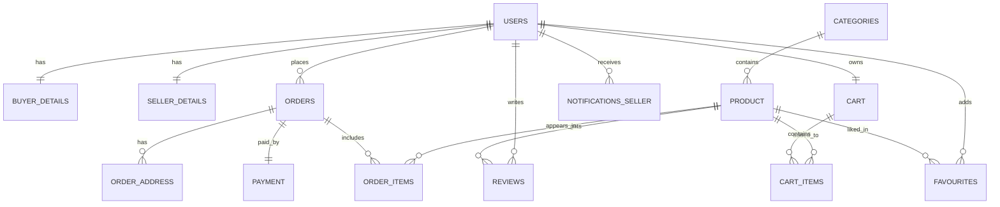

# RevShop_P1
RevShop is a Java console-based e-commerce application for buyers and sellers, built using layered architecture and Oracle Database, supporting registration, login, product management, and order workflows.

## Database ER Diagram

